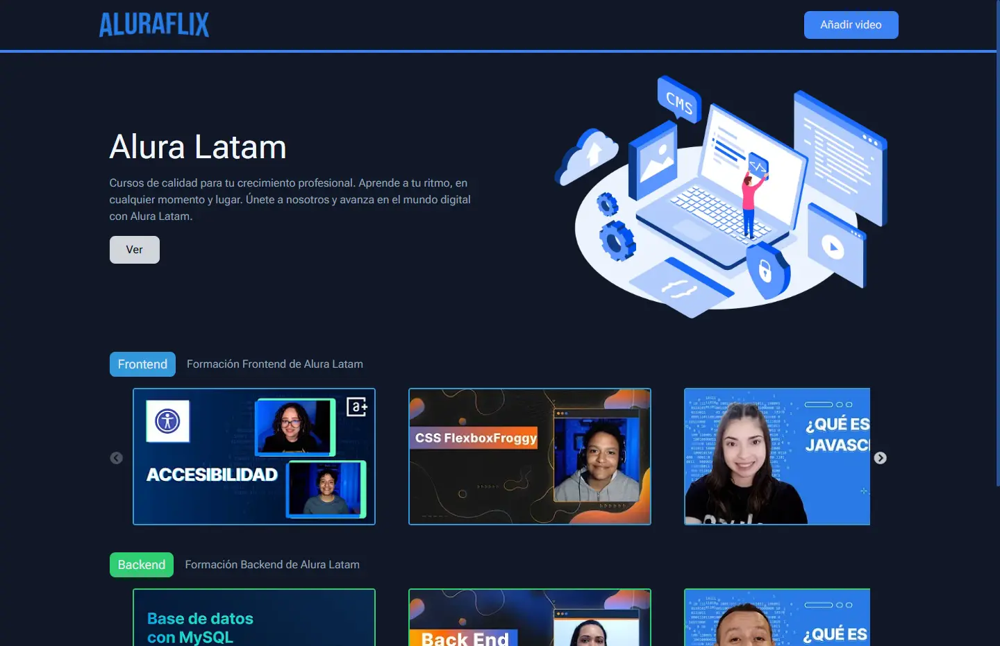

# Aluraflix - Challenge ONE React - Leidy Correa S

El propósito de este desafío es desarrollar una plataforma similar a Netflix, pero dedicada a los cursos de Alura. 🎬📚 Aquí, los usuarios podrán explorar una amplia variedad de cursos organizados por categorías 📂 y tendrán la oportunidad de contribuir al contenido, agregando nuevos videos y categorías. 🎥🆕👨🏻

## Resumen

### Requisitos del desafío

- Crear el componente de Registro de Nueva Categoría
- Crear el componente de Registro de Nuevo Video
- Crear el componente Home
- Crear las Rutas que para navegar entre las diferentes páginas de la aplicación
- Hacer las llamadas al servidor
- Usar el json-server para simular una API y verificar el funcionamiento de la aplicación
- Hacer el deploy de la aplicación

### Características

#### Registro de Nueva Categoría

Permite a los usuarios agregar nuevas categorías de cursos a la plataforma con una interfaz intuitiva y amigable para facilitar la creación de categorías.

#### Registro de Nuevo Video

Brinda la capacidad de agregar nuevos videos a la plataforma, asociándolos con categorías existentes.

#### Navegación entre Páginas

Implementa un sistema de rutas que permite a los usuarios moverse fácilmente entre las diferentes secciones de la aplicación.
Garantiza una experiencia de usuario fluida y sin contratiempos.

### Construido con:

- Semantic HTML5 markup
- Json-Server
- [React](https://react.dev/)
- [React Router](https://reactrouter.com/en/main)
- [Vite](https://vitejs.dev/)

## Author

- GitHub - [Leidy Correa S (Lkiut)](https://github.com/Lkiut)
- ONE – Oracle Next Education - [Oracle](https://www.oracle.com/lad/education/oracle-next-education/)
- Alura LATAM - [Alura](https://www.aluracursos.com/)
